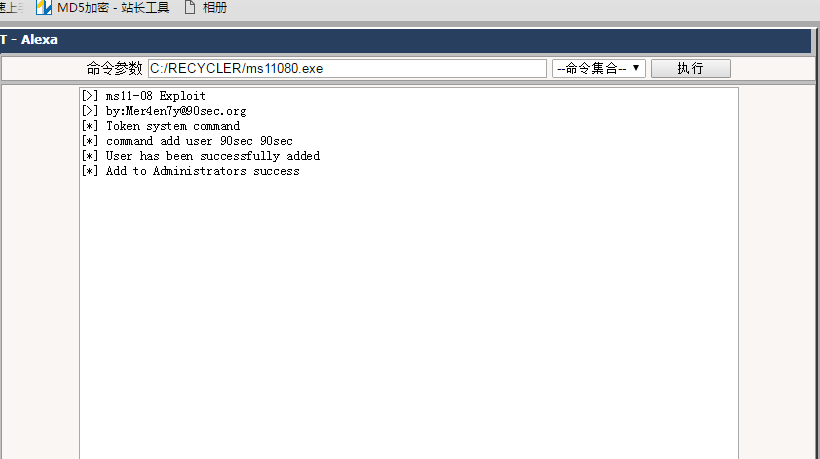

####ms11080提权步奏
#####1.首先执行命令看看webshell是什么权限
```
	windows下面一般是iisuser,或者是network权限，提权要做的就是把network权限提到系统权限

	用whoami命令就行
```
#####2.找可写目录
```
在tools文件夹下面有可读写目录探测文件夹，里面放有扫可写目录的脚本
PHP 搜索可读可写目录脚本.php
GetACL.aspx
啊D小工具 - 目录读写检测 [ASP版].asp
checkacl.exe
```

#####3.执行ms11080 exp
进入垃圾箱目录


直接上传exp到垃圾箱


执行exp，如果出现下面的回显说明提权成功，成功添加90sec/90sec管理员账户


